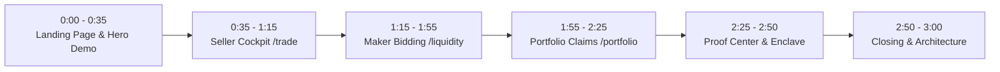

# HushFlow — Hackathon Demo Video Script & Walkthrough Guide

**Project:** HushFlow (Confidential RFQ & Settlement Layer for XRPFi on Flare Network)  
**Target Video Duration:** ~2:45 to 3:00 minutes  
**Target Resolution:** 1080p (Full HD), Browser Fullscreen / 100% Zoom  
**Live Web App URL:** `https://hushflow.vercel.app`  
**Public Simulated FCC Proxy:** `https://fcc.hushflow.dev/info`  
**Coston2 Contract Address:** `0x5bdfb417953fd1f87383dc07b8677a5b9cc880ab`  

---

## 📋 Browser Tabs Setup Before Recording

Prepare and open the following tabs in order:

1. **Tab 1 (Landing Page):** `https://hushflow.vercel.app/`
2. **Tab 2 (Trading Cockpit - Seller):** `https://hushflow.vercel.app/trade`
3. **Tab 3 (Liquidity Provider - Maker):** `https://hushflow.vercel.app/liquidity`
4. **Tab 4 (Portfolio & Settlements):** `https://hushflow.vercel.app/portfolio`
5. **Tab 5 (Proof Center):** `https://hushflow.vercel.app/proof`
6. **Tab 6 (Public Simulated FCC Endpoint):** `https://fcc.hushflow.dev/info`
7. **Tab 7 (Coston2 Explorer):** `https://coston2-explorer.flare.network/address/0x5bdfb417953fd1f87383dc07b8677a5b9cc880ab`

---

## 🎬 Full Scene-by-Scene Script

---

### 🕒 SCENE 1: Landing Page & Problem Statement (0:00 – 0:35)

* **Screen View:** Tab 1 (`https://hushflow.vercel.app/`)
* **Mouse Actions:**
  1. *(0:00 - 0:15)* Hover over the Hero Header, badge *"Flare Confidential Compute · Coston2 Testnet Live"*, and tagline *"Confidential Execution Layer for XRPFi"*.
  2. *(0:15 - 0:30)* Click consecutively on the 4 tabs of the **Interactive Hero Demo Card** (*Step 1: Request $\rightarrow$ Step 2: Blind Bidding $\rightarrow$ Step 3: TEE Matching $\rightarrow$ Step 4: Settlement*).
  3. *(0:30 - 0:35)* Click the top navbar link **"Trade"** to navigate to `/trade`.

> 🎙️ **Voiceover Script (English):**  
> *"Welcome to **HushFlow** — the confidential execution and settlement protocol for XRPFi on Flare Network.*  
> 
> *Public RFQs leak critical market data. Sellers reveal price floors and market makers leak pricing models, exposing everyone to front-running, sandwich attacks, and predatory MEV.*  
> 
> *HushFlow solves this: commercial matching runs inside isolated **Flare Confidential Compute (FCC)** enclaves, settling atomically on Coston2.*  
> 
> *Let’s walk through the full product suite."*

---

### 🕒 SCENE 2: Seller Side — Trading Cockpit & FTSO V2 (`/trade`) (0:35 – 1:15)

* **Screen View:** Tab 2 (`https://hushflow.vercel.app/trade`)
* **Mouse Actions:**
  1. *(0:35 - 0:45)* Move mouse over the **Interactive SVG Market Chart** (hover along the curve to trigger the crosshair tooltip `$2.4852` and click timeframe `24H` or `7D`).
  2. *(0:45 - 0:55)* Highlight the telemetry badge *"Flare FTSO V2 Anchor"* and the *"ECIES Sealed"* indicator.
  3. *(0:55 - 1:15)* In the **"Create Private RFQ"** form on the right:
     - Keep Lot at `1.0 FXRP` and Secret Minimum at `4.0 USDT0` (highlight *"Encrypted for TEE"*).
     - Click **"Sign & Broadcast Sealed RFQ →"**.
     - Watch the 3-step encryption progression (*"Encrypting with ECIES-secp256k1..."* $\rightarrow$ *"Routing to Flare FCC TEE Enclave..."* $\rightarrow$ *"Escrowing in HushFlowRfq.sol..."*) until the **Success Banner (Tx `0xce351a60...`)** appears.

> 🎙️ **Voiceover Script (English):**  
> *"First, the Seller experience on `/trade`.*  
> 
> *Traders get institutional telemetry anchored by **Flare FTSO V2** at 2.485 USDT0 to ensure fair reference pricing.*  
> 
> *A seller deposits 1 FXRP lot and sets a secret reserve price of 4.0 USDT0. This floor price is encrypted client-side using ECIES-secp256k1 before broadcast. To searchers in the mempool, it is 100% opaque ciphertext."*

---

### 🕒 SCENE 3: Maker Side — Liquidity Provider (`/liquidity`) (1:15 – 1:55)

* **Screen View:** Tab 3 (`https://hushflow.vercel.app/liquidity`)
* **Mouse Actions:**
  1. *(1:15 - 1:25)* Highlight the **"ACTIVE RFQ TARGET"** card (`#RFQ-0042`, lot 1.0 FXRP, required collateral 5.0 USDT0).
  2. *(1:25 - 1:40)* In the **"Submit Sealed Quote"** form on the right, click the quick button `4.0 USDT0` and highlight *"Required Escrow Collateral 5.0 USDT0 (100% Refundable)"*.
  3. *(1:40 - 1:55)* Click **"Sign & Submit Encrypted Quote →"** (watch the TEE public key encryption sequence $\rightarrow$ collateral escrow $\rightarrow$ **Success Banner Tx `0xb6448e17...`**).

> 🎙️ **Voiceover Script (English):**  
> *"Next, the Liquidity Provider experience on `/liquidity`.*  
> 
> *Market makers inspect active target RFQs without ever seeing the seller's secret floor or competing quotes.*  
> 
> *A maker submits a sealed bid of 4.0 USDT0 backed by 5.0 USDT0 collateral. Their bid is encrypted with the Flare TEE public key, ensuring rival makers cannot spy on or shade their quotes."*

---

### 🕒 SCENE 4: Accounting & Settlements — Portfolio (`/portfolio`) (1:55 – 2:25)

* **Screen View:** Tab 4 (`https://hushflow.vercel.app/portfolio`)
* **Mouse Actions:**
  1. *(1:55 - 2:10)* Point out the 3 top balance summary cards: **Locked Collateral** (5.00 USDT0), **Claimable Proceeds** (4.00 USDT0), and **Settled Assets** (1.00 FXRP).
  2. *(2:10 - 2:25)* Scroll down to the position rows:
     - Highlight **Seller Row**: Offered 1.0 FXRP $\rightarrow$ Received 4.00 USDT0.
     - Highlight **Winning Provider Row**: Bid 4.00 USDT0 $\rightarrow$ Received 1.0 FXRP lot.
     - Highlight **Outbid Provider Row**: Bid 3.50 USDT0 $\rightarrow$ **5.0 USDT0 Collateral 100% Refunded**.

> 🎙️ **Voiceover Script (English):**  
> *"On the `/portfolio` dashboard, users track their settled positions and escrow balances.*  
> 
> *Once our Flare TEE extension evaluates the envelopes, the on-chain contract enforces terminal claims: the seller receives 4 USDT0, the winning maker receives the FXRP lot, and non-winning makers automatically receive a guaranteed 100% collateral refund through non-custodial pull claims."*

---

### 🕒 SCENE 5: Verifiable Proofs, Live Enclave & Explorer (2:25 – 2:50)

* **Screen View:** Switch between Tab 5 (`/proof`), Tab 6 (`fcc.hushflow.dev/info`), and Tab 7 (Coston2 Explorer).
* **Mouse Actions:**
  1. *(2:25 - 2:35)* In `/proof`, show the audit trail and verifiable attestation receipts.
  2. *(2:35 - 2:42)* In `https://fcc.hushflow.dev/info`, show the live public simulated proxy response (`chainId: 114`, `initialSigningPolicyId: 5936`, `publicKey`).
  3. *(2:42 - 2:50)* In Coston2 Explorer, show the deployed contract `0x5bdfb417...` and confirmed transactions.

> 🎙️ **Voiceover Script (English):**  
> *"In our **Proof Center**, every state transition produces verifiable receipts.*  
> 
> *Our public simulated Flare TEE proxy endpoint is reachable at `fcc.hushflow.dev/info`, and on the Flare Coston2 Explorer, all 11 lifecycle drill transactions are confirmed on-chain at our deployed contract."*

---

### 🕒 SCENE 6: Engineering Rigor & Conclusion (2:50 – 3:00)

* **Screen View:** Return to Tab 1 (`https://hushflow.vercel.app/`) or GitHub Repo.
* **Mouse Actions:** Scroll briefly past the architecture diagram and security disclosures.

> 🎙️ **Voiceover Script (English):**  
> *"With 325 passing automated tests, formal invariant suites, and complete Flare FCC integration, HushFlow brings true confidential trading to XRPFi. Thank you for evaluating our submission!"*

---

## 💡 Practical Recording Tips for Best Score

1. **Pre-test Clicks:** Do a 60-second dry run clicking across the tabs so your mouse movements look smooth and confident.
2. **Audio Quality:** Use a decent headset or microphone in a quiet room with minimal background echo.
3. **Upload Setting:** Upload to YouTube as **Unlisted** (or **Public**) with title *"HushFlow — Hackathon Demo | Flare FCC & XRPFi"*.
