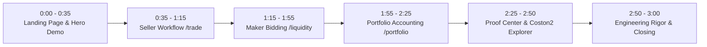

# HushFlow — Hackathon Demo Video Script & Walkthrough Guide

**Project:** HushFlow (Confidential RFQ & Settlement Layer for XRPFi on Flare Network)  
**Target Video Duration:** ~2:45 to 3:00 minutes  
**Target Resolution:** 1080p (Full HD), Browser Fullscreen / 100% Zoom  
**Live Web App URL:** `https://hushflow.dev`  
**Public Simulated FCC Proxy:** `https://fcc.hushflow.dev/info`  
**Coston2 Contract Address:** `0x5bdfb417953fd1f87383dc07b8677a5b9cc880ab`  

---

## 📋 Browser Tabs Setup Before Recording

Prepare and open the following tabs in order:

1. **Tab 1 (Landing Page):** `https://hushflow.dev/`
2. **Tab 2 (Trading Cockpit - Seller):** `https://hushflow.dev/trade`
3. **Tab 3 (Liquidity Provider - Maker):** `https://hushflow.dev/liquidity`
4. **Tab 4 (Portfolio & Accounting):** `https://hushflow.dev/portfolio`
5. **Tab 5 (Proof Center):** `https://hushflow.dev/proof`
6. **Tab 6 (Coston2 Explorer):** `https://coston2-explorer.flare.network/address/0x5bdfb417953fd1f87383dc07b8677a5b9cc880ab`
7. **Tab 7 (Public Simulated FCC Endpoint):** `https://fcc.hushflow.dev/info`

---

## 🎬 Full Scene-by-Scene Script

---

### 🕒 SCENE 1: Landing Page & Problem Statement (0:00 – 0:35)

* **Screen View:** Tab 1 (`https://hushflow.dev/`)
* **Mouse Actions:**
  1. *(0:00 - 0:15)* Hover over the Hero Header, badge *"Flare Confidential Compute · Coston2 Testnet Live"*, and tagline *"Confidential Execution Layer for XRPFi"*.
  2. *(0:15 - 0:30)* Click consecutively on the 4 tabs of the **Interactive Hero Demo Card** (*Step 1: Request $\rightarrow$ Step 2: Blind Bidding $\rightarrow$ Step 3: TEE Matching $\rightarrow$ Step 4: Settlement*).
  3. *(0:30 - 0:35)* Click the top navbar link **"Trade"** to navigate to `/trade`.

> 🎙️ **Voiceover Script (English):**  
> *"Welcome to **HushFlow** — the confidential execution and settlement protocol for XRPFi on Flare Network.*  
> 
> *Public RFQs leak critical market data. Sellers reveal price floors and market makers leak private pricing models, exposing participants to front-running, sandwich attacks, and predatory MEV.*  
> 
> *HushFlow solves this by decoupling private negotiation from public settlement. Commercial matching is evaluated off-chain using the official Flare Confidential Compute (FCC) scaffold in simulated-TEE mode, settling mathematically on Flare Coston2.*  
> 
> *Let’s walk through the product interface and on-chain verification."*

---

### 🕒 SCENE 2: Seller Side — Trading Walkthrough (`/trade`) (0:35 – 1:15)

* **Screen View:** Tab 2 (`https://hushflow.dev/trade`)
* **Mouse Actions:** *(UI Walkthrough — Do NOT click submit button)*
  1. *(0:35 - 0:50)* Hover along the **Market Chart** curve and point out the reference baseline price ($2.485 USDT0) and *"ECIES Sealed"* indicator.
  2. *(0:50 - 1:15)* In the **"Create Private RFQ"** card on the right:
     - Point mouse to **Offer Asset Lot** (`1.0 FXRP` custody).
     - Point mouse to **Secret Minimum Price** (`4.0 USDT0`) and highlight the badge *"Encrypted for TEE"*.
     - Explain the client-side encryption without triggering a transaction submission.

> 🎙️ **Voiceover Script (English):**  
> *"This interface illustrates the seller and maker workflow.*  
> 
> *Here on the trading desk, the seller sets up an order to swap 1 FXRP with a secret reservation price of 4.0 USDT0.*  
> 
> *Private terms are designed to be ECIES-sealed client-side before entering the FCC resolution path, making the floor price completely opaque to searchers in the mempool. For this hackathon demo, the UI uses a controlled settlement scenario rather than submitting a fresh trade during recording."*

---

### 🕒 SCENE 3: Maker Side — Liquidity Provider Desk (`/liquidity`) (1:15 – 1:55)

* **Screen View:** Tab 3 (`https://hushflow.dev/liquidity`)
* **Mouse Actions:** *(UI Walkthrough — Do NOT click submit button)*
  1. *(1:15 - 1:35)* Hover over the **"ACTIVE RFQ TARGET"** card (`#RFQ-0042`, lot 1.0 FXRP, required collateral 5.0 USDT0, oracle reference anchor).
  2. *(1:35 - 1:55)* In the **"Submit Sealed Quote"** card on the right:
     - Point to the **Private Bid** field (`4.0 USDT0`) with *"Encrypted for TEE"*.
     - Point to the **Required Escrow Collateral** field (`5.0 USDT0`) highlighting *"100% Refundable"*.

> 🎙️ **Voiceover Script (English):**  
> *"On the maker side, liquidity providers inspect active target RFQs without seeing the seller's secret floor or competing quotes.*  
> 
> *Makers submit sealed bids backed by refundable collateral, encrypted with the Flare TEE public key so rival makers cannot spy on or shade their quotes.*  
> 
> *All quotes remain confidential until decrypted simultaneously inside the enclave during batch clearing."*

---

### 🕒 SCENE 4: Accounting & Settlements — Portfolio (`/portfolio`) (1:55 – 2:25)

* **Screen View:** Tab 4 (`https://hushflow.dev/portfolio`)
* **Mouse Actions:**
  1. *(1:55 - 2:10)* Point to the 3 top balance summary cards: **Locked Collateral** (5.00 USDT0), **Claimable Proceeds** (4.00 USDT0), and **Settled Assets** (1.00 FXRP).
  2. *(2:10 - 2:25)* Scroll down to highlight the three participant outcomes:
     - **Seller:** Delivered 1.0 FXRP $\rightarrow$ Received 4.00 USDT0 proceeds.
     - **Winning Provider:** Bid 4.00 USDT0 $\rightarrow$ Received 1.0 FXRP lot.
     - **Outbid Provider:** Bid 3.50 USDT0 $\rightarrow$ **5.0 USDT0 Collateral 100% Refunded**.

> 🎙️ **Voiceover Script (English):**  
> *"The accounting screen visualizes the settlement outcome: seller proceeds, winner delivery, and losing-maker collateral refund. The on-chain evidence is shown next.*  
> 
> *Once the FCC enclave evaluates the sealed envelopes, the smart contract guarantees non-custodial pull claims: proceeds go to the seller, assets go to the winning bidder, and all non-winning collateral is unlocked for full refund."*

---

### 🕒 SCENE 5: Verifiable Settlement Drill & Flare FCC Boundary (2:25 – 2:50)

* **Screen View:** Tab 5 (`/proof`) $\rightarrow$ Tab 6 (Coston2 Explorer) $\rightarrow$ Tab 7 (`fcc.hushflow.dev/info`).
* **Mouse Actions:**
  1. *(2:25 - 2:33)* In `/proof`, show the cryptographic audit trail and contract verifier address.
  2. *(2:33 - 2:43)* In Coston2 Explorer (Tab 6), show the `HushFlowRfq` contract and highlight key confirmed transactions from our 11-step drill:
     - `CREATE_RFQ` (`0xce351a60...`)
     - `SUBMIT_RESULT` (`0xcbdda0ae...`)
     - `CLAIM_SELLER` (`0xc6dcf965...`) and collateral refunds.
  3. *(2:43 - 2:50)* Switch to `https://fcc.hushflow.dev/info` (Tab 7) to show the live public simulated proxy response (`chainId: 114`, `initialSigningPolicyId: 5936`, `publicKey`).

> 🎙️ **Voiceover Script (English):**  
> *"Here is the verifiable boundary: HushFlow has executed an 11-transaction controlled settlement drill on Flare Coston2.*  
> 
> *Separately, this public endpoint exposes our FCC scaffold running in simulated-TEE mode. We do not claim production hardware attestation in this demo.*  
> 
> *The production path requires registering a Confidential Space machine through Flare’s FCC lifecycle. The contract, resolver, and scaffold adapter are structured for that transition."*

---

### 🕒 SCENE 6: Engineering Rigor & Conclusion (2:50 – 3:00)

* **Screen View:** Return to Tab 1 (`https://hushflow.dev/`) or GitHub Repo.
* **Mouse Actions:** Scroll briefly past the architecture diagram and security disclosures.

> 🎙️ **Voiceover Script (English):**  
> *"With 325 passing automated tests, formal invariant suites, and complete Flare FCC integration, HushFlow brings verifiable, confidential trading to XRPFi. Thank you for evaluating our submission!"*

---

## 💡 Practical Recording Tips for Best Score

1. **Keep Recording Clean:** Follow the tab sequence Tab 1 $\rightarrow$ Tab 2 $\rightarrow$ Tab 3 $\rightarrow$ Tab 4 $\rightarrow$ Tab 5 $\rightarrow$ Tab 6 $\rightarrow$ Tab 7.
2. **No Fake Submissions:** Avoid pressing submit buttons during the walkthrough; let the block explorer on Tab 6 serve as the immutable proof of settlement.
3. **Audio Quality:** Use a decent headset or microphone in a quiet room with minimal background echo.
4. **Upload Setting:** Upload to YouTube as **Unlisted** (or **Public**) with title *"HushFlow — Hackathon Demo | Flare FCC & XRPFi"*.
